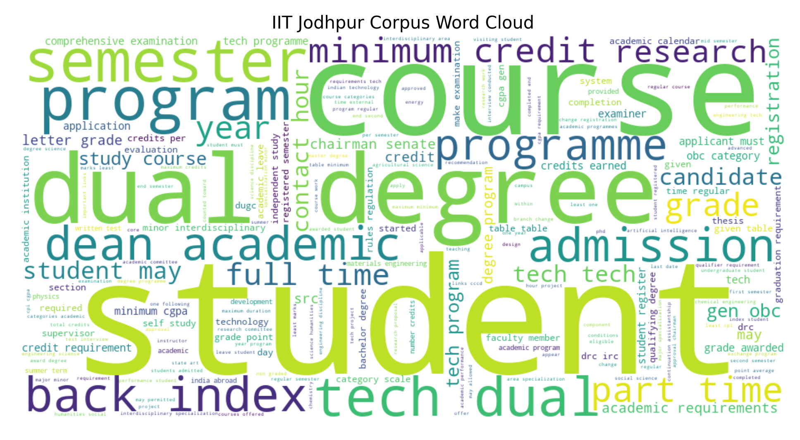
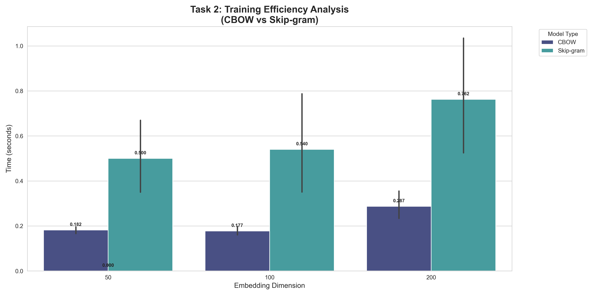
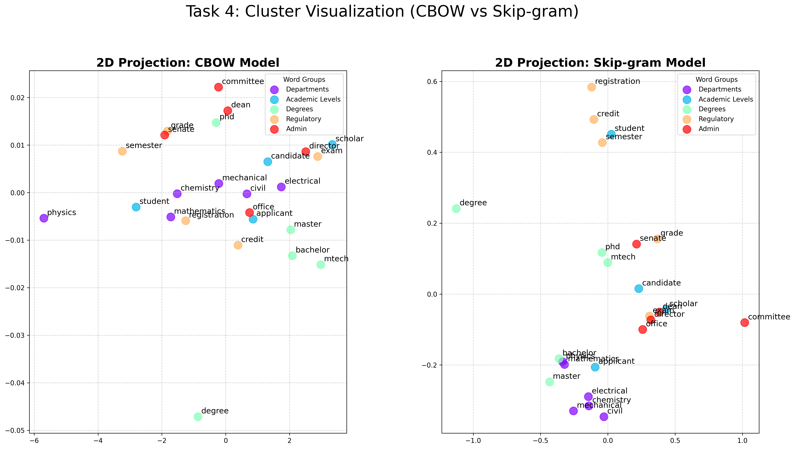
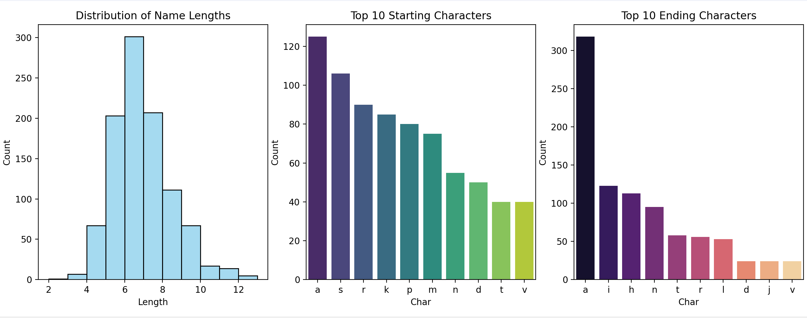

# IIT Jodhpur NLP Assignment: Word Embeddings & Semantic Analysis

This repository contains the implementation for a two-part Natural Language Processing assignment.

- **Problem 1:** Institutional Word2Vec Model (IIT Jodhpur corpus)
- **Problem 2:** Character-Level Indian Name Generation using RNN architectures

---

# 📂 Project Structure

    .
    ├── question1/
    │   ├── data/
    │   │   ├── corpus.txt
    │   │   └── raw_corpus.txt
    │   │
    │   ├── outputs/
    │   │   ├── task2_experiment_results.csv
    │   │   ├── task2_performance_visualization.png
    │   │   ├── task4_clusters_comparison.png
    │   │   └── word_cloud.png
    │   │
    │   ├── scripts/
    │   │   ├── p1_task1.py
    │   │   ├── p1_task2.py
    │   │   ├── p1_task3.py
    │   │   └── p1_task4.py
    │   │
    │   └── trained_models/
    │       ├── cbow_d50_w2_n5.model
    │       ├── ... (all 36 models)
    │
    ├── question2/
    │   ├── data/
    │   │   └── TrainingNames.txt
    │   │
    │   ├── outputs/
    │   │   ├── attention_generated.txt
    │   │   ├── blstm_generated.txt
    │   │   ├── vanilla_generated.txt
    │   │   └── name_analysis.png
    │   │
    │   ├── scripts/
    │   │   ├── attention.py
    │   │   ├── BLSTM.py
    │   │   ├── VanillaRNN.py
    │   │   ├── name_analysis.py
    │   │   └── p2_task2.py
    │
    └── README.md

---

# 🚀 Installation & Prerequisites

Install all required dependencies:

    pip install requests beautifulsoup4 pypdf2 nltk gensim pandas matplotlib seaborn scikit-learn wordcloud torch numpy

---

# 🛠️ Problem 1: Institutional Word2Vec Model

## 📌 Overview

Build a domain-specific Word2Vec model using IIT Jodhpur data (web + PDFs), and analyze semantic relationships.

---

## ⚙️ How to Run (Step-by-Step)

### Step 1: Data Collection & Preprocessing

    cd question1/scripts
    python p1_task1.py

✔ Generates:
- `corpus.txt`
- `word_cloud.png`

---

### Step 2: Train Models (36 combinations)

    python p1_task2.py

✔ Generates:
- Models in `trained_models/`
- `task2_experiment_results.csv`
- `task2_performance_visualization.png`

---

### Step 3: Semantic Analysis

    python p1_task3.py

✔ Performs:
- Nearest neighbors
- Analogies

---

### Step 4: PCA Visualization

    python p1_task4.py

✔ Generates:
- `task4_clusters_comparison.png`

---

## 📊 Key Results

### Training Efficiency

- Skip-gram slower than CBOW  
- Example (200D):
  - Skip-gram: 1.28s  
  - CBOW: 0.27s

---

### Semantic Understanding

- phd ↔ mtech  
- research ↔ development  

- Analogy:
    faculty : research :: student : semesters  

---

### Clustering
- Skip-gram → tight clusters  
- CBOW → scattered embeddings  

---

# 🧠 Problem 2: Character-Level Indian Name Generation

## 📌 Overview
Generate Indian names using 3 architectures:
- Vanilla RNN  
- Bidirectional LSTM  
- Attention-based GRU  

---

## ⚙️ How to Run

### Step 1: Navigate

    cd question2/scripts

---

### Step 2: Train & Generate Names

#### Vanilla RNN

    python VanillaRNN.py

#### BLSTM

    python BLSTM.py

#### Attention Model

    python attention.py

---

### Step 3: Analyze Results

    python name_analysis.py

✔ Generates:
- `name_analysis.png`

---

### Evaluation Script

    python p2_task2.py

---

## 🧪 Dataset & Processing

- 1000 Indian names  
- Character-level tokenization  
- Special tokens:
  - `<PAD>`, `<SOS>`, `<EOS>`  
- Vocabulary size: **29**

---

## 🏗️ Model Summary

### Vanilla RNN
- Simple recurrence  
- Memorization-heavy  

### BLSTM
- Forward + backward context  
- High capacity → overfitting  

### Attention GRU
- Uses attention over past states  
- Best generalization  

---

## 📊 Results

| Model            | Novelty (%) | Diversity |
|------------------|------------|----------|
| Vanilla RNN      | 11.00%     | 0.98     |
| BLSTM            | 100.00%    | 1.00     |
| Attention GRU    | 17.00%     | 0.86     |

---

## 🔍 Observations

- Vanilla → memorizes dataset  
- BLSTM → stuttering issue  
- Attention → most realistic + novel  

Example generated names:
- Xavikrat  
- Bhumakin  

---

# 👤 Author

**Vandita Gupta**  
Pre-final year Undergraduate  
B.Tech in Artificial Intelligence & Data Science  
IIT Jodhpur
